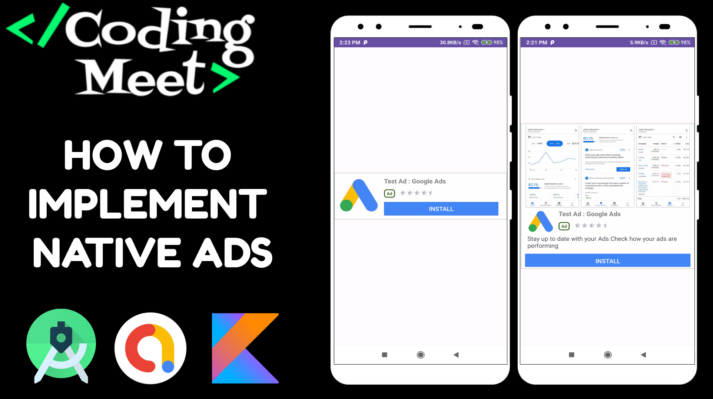

# Google-Admob-Integration-App

Welcome to our comprehensive series of tutorials on monetizing your Android app through ad implementation. Whether you're a beginner or an experienced developer, this playlist will guide you through the process of integrating different types of ads into your Android app using Kotlin and Android Studio. Maximize your app's revenue and enhance the user experience with our step-by-step tutorials on various ad formats.

## Tutorials

- [**How to Implement Banner Ads in Android Studio with Kotlin**](https://youtu.be/NXuXbXN1llY?si=7Ie8in5u0i_HVRBJ)

  - Learn how to integrate banner ads into your Android app for monetization.

- [**How to Implement Interstitial Ads in Android Studio with Kotlin**](https://youtu.be/J9kX_UotWhM?si=hBvC1Bk4B1nxxajd)

  - Discover how to seamlessly integrate interstitial ads for higher ad revenue in your app.

- [**How to Implement Native Ads in Android Studio with Kotlin**](https://youtu.be/QSLzAEaToVg?si=XGUmNfIzvRprx0Ue)

  - Enhance user experience by integrating non-disruptive native ads within your app.

- [**How to Implement Rewarded Ads in Android Studio with Kotlin**](https://youtu.be/-vWtsyfrHwI?si=h5-z8ODn_oCNsZVL)

  - Motivate and retain users by offering rewards through rewarded ads.

- [**How to Implement Rewarded Interstitial Ads in Android Studio with Kotlin**](https://youtu.be/IOjQNcWZRGg?si=8CkOX9r0Do6QoqUy)

  - Reward your users while maximizing app revenue with rewarded interstitial ads.

- [**How to Implement App Open Ads in Android Studio with Kotlin**](https://youtu.be/IxfE8lm3fMA?si=M-gXwbOBpp_mmDQz)

  - Elevate your app's loading screen with monetization opportunities.
 
- [**How to Integrate Native Ads Inside Recycler View in Android Studio Kotlin**](https://youtu.be/QHcDGgBVoeU?si=Wx9RwTh_YUdsSj-f)

  - Enhance user experience by integrating native ads in a RecyclerView.

Stay tuned for each tutorial in the series, and don't forget to like, subscribe, and hit the notification bell to stay updated with our latest content! 💰📱

## Support the Project

If you find this tutorial series helpful and would like to support the development of more content, consider buying me a coffee! Your support helps in creating high-quality tutorials.

Your generosity is greatly appreciated! Thank you for supporting this project.

